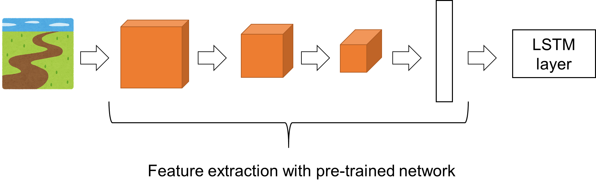
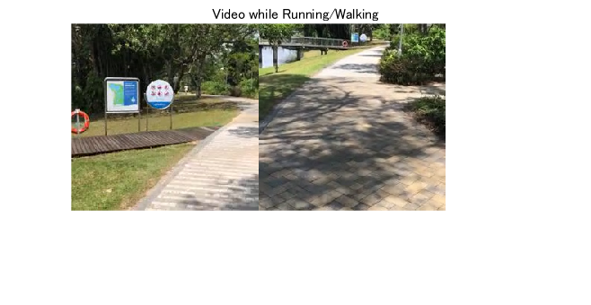
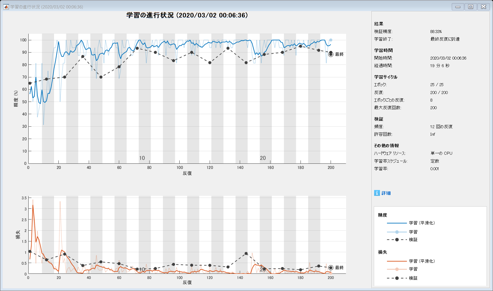
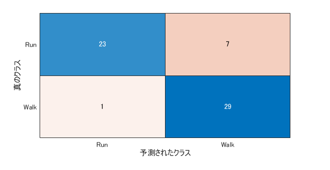

[](https://jp.mathworks.com/matlabcentral/fileexchange/74402-video-classification-using-lstm-lstm)

# Running/Walking Classification with Video Clips using LSTM 
This is a simple example of video classification using LSTM with MATLAB.

[English]  
This is a simple example of video classification using LSTM with MATLAB.
Please run the code named VideoClassificationExample.
This example was created based on a Mathworks official documentation located [here](https://jp.mathworks.com/help/deeplearning/examples/classify-videos-using-deep-learning.html). While the official example requires down-loading a dataset about 2 GB, this example can try that
with a small amout of data, which may help you giving a try easily.
Note that this is just an example of LSTM with images and please refer to the official example for your further study.
I appreciate for the free pictures from used in the thumbnail and live editor obtrained from this [page](https://www.irasutoya.com/).  
<br>  

[Japanese]  
深層学習を用いてビデオの分類を行います。その人が歩いているのか/走っているのかをその人の頭に取り付けたカメラの動画から予測します。動画のフレームを入力とし、学習済みネットワークにより特徴量を取り出します。そして、その特徴量からLSTMによる分類を行います。静止画の分類は多く紹介されていますが、ビデオを入力とし、その数秒間のビデオから対象が何であるかを分類する例はmatlab document中にあまり多くありませんでした。また公式ドキュメントにも例はありますが、２ギガのデータセットをダウンロードする必要があり、ダウンロードや計算に多くの時間がかかり、手軽に試すにはやや不向きです。参考になれば幸いです。

[References]
[1] Matlab Official Documentation: [Classify Videos Using Deep Learning](https://jp.mathworks.com/help/deeplearning/ug/classify-videos-using-deep-learning.html)    
[2] [Irasutoya](https://www.irasutoya.com) : images in the script were obtained from this website  

While the official example requires down-loading a dataset about 2 GB, this example can try that with a small amout of data, which may help you giving a try easily.
Note that this is just an example of LSTM with images and please refer to the official example for your further study.  


# Load Pretrained Convolutional Network

   -  A pre-trained network, resnet 18 was used for feature extraction here in this example. 
   -  The features extracted from the pre-trained network were fed into LSTM layer as shown below.  
   -  Other networks such as googlenet, resnet50, and mobilenetv2 are available.  
   -  You may choose other networks when the final accuracy is not high enough. 





```matlab
clear;clc;close all
% if you have not down-loaded the pre-trained network resnet18, pls get it
% from "add-in". 
netCNN = resnet18;
```
# Load Data

   -  The video clips for the classification were retrieved from the videos recorded while running and walking which lasted about 5 min and 10 min, respectively.  
   -  The 2 kinds of video were taken at the same path to exclude the difference of the scene to capture. 
   -  In the future example, the scence with various place/moving condition should be prepared.     

```matlab
RunVideo=VideoReader('Running.mov'); % load the video taken while running
WalkVideo=VideoReader('Walking.mov');% load the video taken while walking
f=figure;
title('Video while Running/Walking');hold on
set(gcf,'Visible','on')
numFrames = 5/(1/RunVideo.FrameRate); %"5" is a duration (second) to show 
for i = 1:numFrames
    RunFrame=readFrame(RunVideo);
    WalkFrame=readFrame(WalkVideo);
    imshow([RunFrame,WalkFrame]);
    drawnow
    pause(1/RunVideo.FrameRate)
    hold on
end
hold off
```



```matlab
% reset the state of waling/running video, otherwise the frames already
% read are not to be retrieved
WalkVideo.CurrentTime=0;
RunVideo.CurrentTime=0;
```
# Read all frames and extract features to save into variables R and W

   -  Image features are extracted with the pre-trained network to feed to the LSTM network with "single type". 
   -  As the process of feature extraction takes a long time, pls load the variable R and W pre-calculated for you.  
   -  The function "activations" returns the vector of the extracted feature.  

```matlab
if (exist('W.mat')==2)&&(exist('R.mat')==2)
    load W.mat
    load R.mat
else
    RFrames=zeros(224,224,3,RunVideo.NumFrames,'uint8');
    WFrames=zeros(224,224,3,WalkVideo.NumFrames,'uint8');
    for i=1:RunVideo.NumFrames
        RFrames(:,:,:,i)=imresize(readFrame(RunVideo),[224 224]);
        % the video frames should be resized into 224 by 224 since the
        % resnet18 only accepts that size. 
    end
    
    for i=1:WalkVideo.NumFrames
        WFrames(:,:,:,i)=imresize(readFrame(WalkVideo),[224 224]);
    end
    R=single(activations(netCNN,RFrames,'pool5','OutputAs','columns'));
    W=single(activations(netCNN,WFrames,'pool5','OutputAs','columns'));
end
```
# Prepare the set of image features of a video clip lasting a few seconds


   -  A video clip whose duration is from minDuration to maxDuration as difined below was obtained.  
   -  You can specify the number of the clips to obtain from each video.  

```matlab
minDuration=2;
maxDuration=4;
numData=100;
FrameRate=RunVideo.FrameRate;
RData=cell(numData,1);
WData=cell(numData,1);
for i=1:numData
    ClipDuration=randi((maxDuration-minDuration)*FrameRate,[1 1])+minDuration*FrameRate;
    StartingFrameNumRun=randi(RunVideo.NumFrames-(maxDuration+minDuration)*FrameRate,[1 1])+minDuration*FrameRate;
    StartingFrameNumWalk=randi(WalkVideo.NumFrames-(maxDuration+minDuration)*FrameRate,[1 1])+minDuration*FrameRate;
    RData{i}=R(:,StartingFrameNumRun:StartingFrameNumRun+ClipDuration);
    WData{i}=W(:,StartingFrameNumWalk:StartingFrameNumWalk+ClipDuration);
end
```
# Prepare Training Data


Prepare the data for training by partitioning the data into training and validation partitions.


**Create Training and Validation Partitions**


Partition the data. Assign 70% of the data to the training partition and 30% to the validation partition.


```matlab
idx = randperm(numData);
N = floor(0.7 * numData);
sequencesTrainRun = {RData{idx(1:N)}};
sequencesTrainWalk = {WData{idx(1:N)}};
sequencesTrain=cat(2,sequencesTrainRun,sequencesTrainWalk);
labelsTrain=categorical([zeros(N,1);ones(N,1)],[0 1],{'Run','Walk'});

sequencesValidRun = {RData{idx(N+1:end)}};
sequencesValidWalk = {WData{idx(N+1:end)}};
labelsValidation=categorical([zeros(numel(sequencesValidWalk),1);ones(numel(sequencesValidWalk),1)],[0 1],{'Run','Walk'});
sequencesValidation=cat(2,sequencesValidRun,sequencesValidWalk);
```
# Create LSTM Network


Create an LSTM network that can classify the sequences of feature vectors representing the videos.


Define the LSTM network architecture. Specify the following network layers.


   -  A sequence input layer with an input size corresponding to the feature dimension of the feature vectors 
   -  Here, the dimension of the extracted feature with resnet18 was 512, meaning the numFeatures is 512.  
   -  LSTM layer with 1500 hidden units with a dropout layer afterwards. To output only one label for each sequence by setting the `'OutputMode'` option of the BiLSTM layer to `'last'` 
   -  You may use BiLSTM  layer with which the image sequences can be learned with forward and backward time-series.  
   -  2 LSTM layer can be put in the "layers" which might learn more detailed information of the time-series data.  
   -  A fully connected layer with an output size corresponding to the number of classes (here, 2), a softmax layer, and a classification layer. 
   -  If you would like to esimated a certain value from the time-series data, you can prepare "regressionLayer" with numerical label (data) instead of the categorical "`labelsTrain`".  
   -  The dropout layer contribute to prevent the network from being "over-tuned" to the training data.  

```matlab
numFeatures = size(R,1);
numClasses = 2;

layers = [
    sequenceInputLayer(numFeatures,'Name','sequence')
    lstmLayer(1500,'OutputMode','last','Name','lstm')
    dropoutLayer(0.5,'Name','drop')
    fullyConnectedLayer(numClasses,'Name','fc')
    softmaxLayer('Name','softmax')
    classificationLayer('Name','classification')];
```
# Specify Training Options


Specify the training options using the `trainingOptions` function.


   -  Set a mini-batch size 16, an initial learning rate of 0.0001, and a gradient threshold of 2 (to prevent the gradients from exploding). 
   -  Shuffle the data every epoch. 
   -  Validate the network once per about three epochs. 
   -  Display the training progress in a plot and suppress verbose output. 
   -  Max epoch: 20 
   -  optimizer: adam 

```matlab
miniBatchSize = 16;
numData = numel(sequencesTrainRun);
numIterationsPerEpoch = floor(numData / miniBatchSize)*3;

options = trainingOptions('adam', ...
    'MiniBatchSize',miniBatchSize, ...
    'MaxEpoch',25, ...
    'InitialLearnRate',1e-3, ...
    'GradientThreshold',2, ...
    'Shuffle','every-epoch', ...
    'ValidationData',{sequencesValidation,labelsValidation}, ...
    'ValidationFrequency',numIterationsPerEpoch, ...
    'Plots','training-progress', ...
    'Verbose',false);
```
# Train LSTM Network with the extracted image features


Train the network using the `trainNetwork` function. 


   -  If you would like to plot the data in training process such as the accucary and loss, please check the values saved in the variable `info`.  

```matlab
[netLSTM,info] = trainNetwork(sequencesTrain,labelsTrain,layers,options);
```




Calculate the classification accuracy of the network on the validation set.  If the accuracy is quite satisfactory, please prepare the test video clips to explore the feasibility of this LSTM network. 


```matlab
YPred = classify(netLSTM,sequencesValidation,'MiniBatchSize',miniBatchSize);
accuracy = mean(YPred == labelsValidation)
```
```
accuracy = 0.8667
```
```matlab
% please confirm the balance of the classification. 
confusionchart(labelsValidation,YPred)
```



```
ans = 
  ConfusionMatrixChart のプロパティ:

    NormalizedValues: [2x2 double]
         ClassLabels: [2x1 categorical]

  すべてのプロパティ を表示

```
# Things to consider 

   1.  some clips are difficult to classify with a short period of the movie => the accuracy is likely to increase if the duration at each clip gets longer 
   1.  What if the two LSTM layers are used while this example uses one LSTM layer? 
   1.  What if BiLSTM layer is used?  

